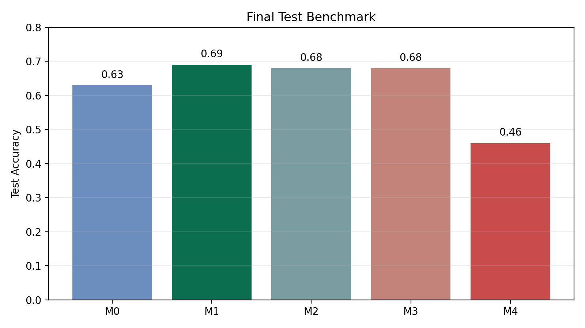
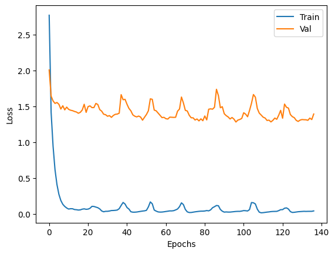
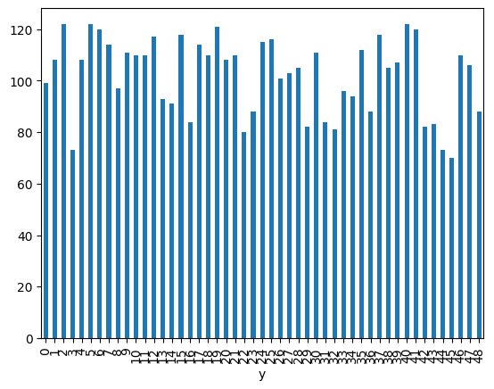

# Neural Networks from Scratch with NumPy

This repository showcases a from-scratch neural-network project built mostly with NumPy for a 49-class image-classification task. The goal was to implement the core training pipeline manually, compare design choices experimentally, and benchmark the final NumPy model against PyTorch versions on the same data split.

**Tech stack:** Python, NumPy, Pandas, Matplotlib, Seaborn, PyTorch, Jupyter

**Headline facts**
- `5,000` labeled grayscale images
- `3200 / 800 / 1000` train / validation / test split
- Best NumPy model reached `0.69` test accuracy



## What I built

The core of the project lives in [`src/`](src), where I implemented a feedforward classifier and its training loop without relying on high-level deep-learning frameworks.

- Manual forward propagation through dense layers
- Backpropagation for multiclass classification with softmax output
- Weight initialization, gradient accumulation, and parameter updates
- Experimentation around optimization, regularization, and architecture depth
- PyTorch reimplementations used as reference baselines, not as the main deliverable

## Core Features

- **From-scratch training logic:** custom `NN` class in [`src/models.py`](src/models.py)
- **Initialization and activations:** He initialization, ReLU hidden layers, softmax output
- **Optimizers:** vanilla SGD and Adam
- **Training mechanics:** full-batch and mini-batch updates, shuffled batches, learning-rate schedules
- **Regularization:** L2 penalty, early stopping, optional dropout
- **Utilities:** dataset splitting, one-hot encoding, normalization helpers, confusion matrix, and accuracy metrics

## Results

Final test-set comparison from the notebook:

| Model | Description | Test Accuracy |
| --- | --- | ---: |
| `M0` | Baseline NumPy network | `0.63` |
| `M1` | Improved NumPy network | `0.69` |
| `M2` | PyTorch reference model | `0.68` |
| `M3` | Tuned PyTorch comparison | `0.68` |
| `M4` | Intentionally overfit PyTorch model | `0.46` |

The strongest outcome in this repo is the improved NumPy implementation: it slightly outperformed the PyTorch reference models on the final test comparison while keeping the learning pipeline fully transparent.



## Visual Evidence

These visuals are extracted from notebook outputs and summarize the project story without rerunning long experiments.



## Project Structure

```text
.
├── README.md
├── Gomez_Matias_Notebook_TP3.ipynb
├── Gomez_Matias_Informe_TP3.pdf
├── data/
│   ├── X_images.npy
│   ├── y_images.npy
│   └── X_COMP.npy
├── assets/
│   ├── best-model-loss.png
│   ├── class-distribution.png
│   └── test-benchmark.png
└── src/
    ├── models.py
    ├── metrics.py
    ├── preprocessing.py
    └── data_splitting.py
```

Supporting materials:

- Notebook: [`Gomez_Matias_Notebook_TP3.ipynb`](Gomez_Matias_Notebook_TP3.ipynb)
- Report: [`Gomez_Matias_Informe_TP3.pdf`](Gomez_Matias_Informe_TP3.pdf)
- Core implementation: [`src/models.py`](src/models.py)

## Quickstart

This is a notebook-driven project.

```bash
python3 -m venv .venv
source .venv/bin/activate
pip install -r requirements.txt
jupyter notebook Gomez_Matias_Notebook_TP3.ipynb
```

The notebook expects the datasets to be present in the local `data/` directory:

- `data/X_images.npy`
- `data/y_images.npy`
- `data/X_COMP.npy`

## Notes and Limitations

- The project was originally developed in an academic setting, but this repository is organized to highlight the engineering work behind the implementation.
- The main workflow is experimental and notebook-based; there is no standalone training CLI yet.
- Metrics and benchmark claims in this README are taken from the saved notebook outputs already included in the repo.
- The NumPy implementation prioritizes transparency and learning value over production-grade performance optimization.
